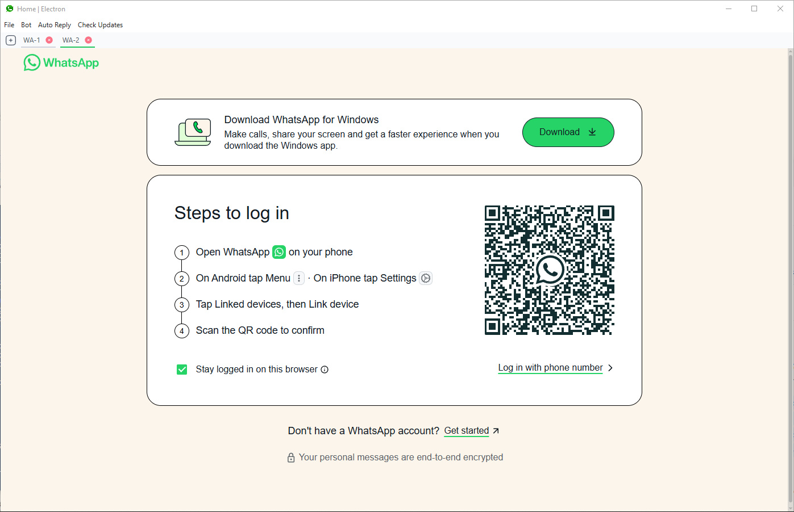

# MWA-Electron

**MWA-Electron** (Multi WhatsApp Accounts via Electron) is a desktop application built with [Electron](https://www.electronjs.org/) that allows you to run multiple WhatsApp Web accounts in a single window using separate tabs. It's ideal for users managing several WhatsApp accounts, such as businesses, customer support teams, or individuals needing to keep accounts separate.

---

## 🚀 Features

* Multi-tab to open multiple WhatsApp accounts
* Sessions are saved locally—no need to log in every time
* Lightweight and easy to use interface
* Dark & ​​Light Mode
* Bailey WhatsApp Bot Integration
* Multi Device For Bots
* Auto Greeting For First Message
* Auto Reply From Bots
* Gemini AI Integration
* Lock Screen
* More

## Support Platform

- [x] **Windows**
- [x] **macOS**
- [x] **Linux**

## 🧩 Notes

* WhatsApp accounts stay logged in as long as session partitions aren't cleared.
* Make sure you're using the latest version of WhatsApp Web for the best compatibility.
* This app does **not** store your data on any server—all session data is kept locally.

---

## 🖥️ Screenshot

---

## 📄 License

This project is licensed under the [MIT License](LICENSE). Feel free to use, modify, and distribute it as needed.
