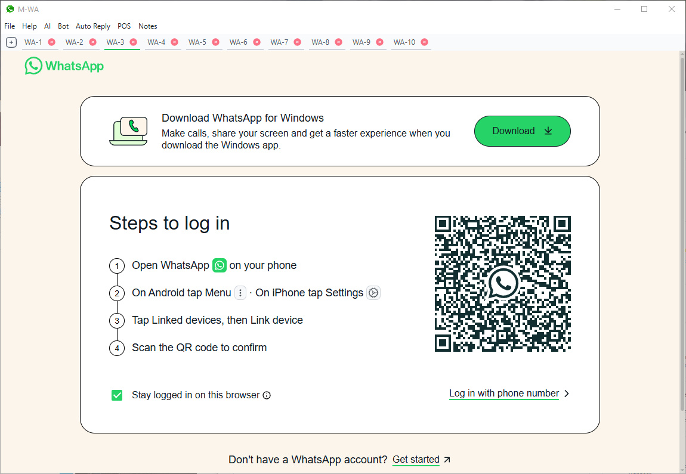

<div align="center">

[](https://github.com/fitri-hy/MWA-Electron/releases/latest)
[](https://github.com/fitri-hy/MWA-Electron/stargazers)
[](https://github.com/fitri-hy/MWA-Electron/network/members)
[](https://github.com/fitri-hy/MWA-Electron/releases)
[](https://github.com/fitri-hy/MWA-Electron/graphs/contributors)
[](https://github.com/fitri-hy/MWA-Electron/issues)
[](https://github.com/fitri-hy/MWA-Electron/pulls)
[](https://github.com/fitri-hy/MWA-Electron/commits/main)
[](https://www.electronjs.org/)
[](https://nodejs.org/)

</div>

<p align="center">
  
</p>

# 💬 MWA-Electron

In today's fast-paced digital environment, managing multiple WhatsApp accounts is often a necessity, whether you're a 💼 small business owner, 🎧 support agent, or just someone juggling personal and professional identities.

**MWA-Electron** empowers you to effortlessly run multiple WhatsApp Web accounts within a single, elegant desktop application. Built on [Electron](https://www.electronjs.org/), it leverages modern web technologies to deliver a fluid, secure, and lightweight experience.

---

## 🚀 Features

MWA-Electron is more than just a multi-account WhatsApp manager, it's your AI-powered business assistant:

#### ✅ WhatsApp Management

- 🧩 Multi-tab Interface
- 🔒 Persistent Sessions
- 🌗 Dark & Light Mode
- 🔐 Lock Screen

#### 🤖 Automation & AI

- 🤝 Bailey WhatsApp Bot Integration
- 📱 Multi-Device Bot Support
- 🙋‍♂️ Auto-Greeting
- ✉️ Auto-Reply
- 🧠 Gemini AI Integration
  - 💬 Intelligent replies
  - 🖼️ Image analysis
  - 🎨 AI-generated image creation

#### 📦 Business Tools

- 🧾 Point of Sales (POS)
- 📄 PDF Invoicing
- 📬 Send Invoices via WhatsApp
- 📊 Invoice Management
- 📦 Inventory Management
- 🧑 Customer Management
- 🏭 Vendor Management
- 📈 Reports

#### 🛡️ Utilities & Productivity

- 🗒️ Notes Manager
- 🔔 Notification Center
- 💾 Data Backup & Restore
- 🧱 Scalable Architecture
- ➕ And More

---

## 💻 Supported Platforms

| Platform | Status |
|-------------|-----------|
| 🖥️ Windows      | ✅        |
| 🖥️ macOS        | ✅        |
| 🖥️ Linux        | ✅        |

---

## 🛠️ Installation & Setup

1. 🧬 Clone the repository:
   ```bash
   git clone https://github.com/fitri-hy/MWA-Electron.git
   cd MWA-Electron
   ```

2. 📦 Install dependencies:
   ```bash
   npm install
   ```

3. ▶️ Run the application:
   ```bash
   npm start
   ```

4. ⚡ Build the application:
   ```
   npm run build
   ```

Or download the latest release from the [📥 Releases Page](https://github.com/fitri-hy/MWA-Electron/releases/latest).

---

## ⚠️ Important Notes

- 📌 Sessions persist **only** if session data isn't manually cleared.
- 🛡️ Your privacy matters: All session data is stored **locally**. MWA-Electron never transmits your chats or credentials externally.

---

## 📄 License

This project is licensed under the [MIT License](LICENSE) — free to use, modify, and distribute with attribution.

---

<p align="center">
  Made with ❤️ by <a href="https://github.com/fitri-hy">fitri-hy</a> &nbsp;|&nbsp;
  <a href="https://github.com/fitri-hy/MWA-Electron">Project Repository</a> &nbsp;|&nbsp;
  <a href="https://github.com/fitri-hy/MWA-Electron/releases/latest">Latest Release</a>
</p>
