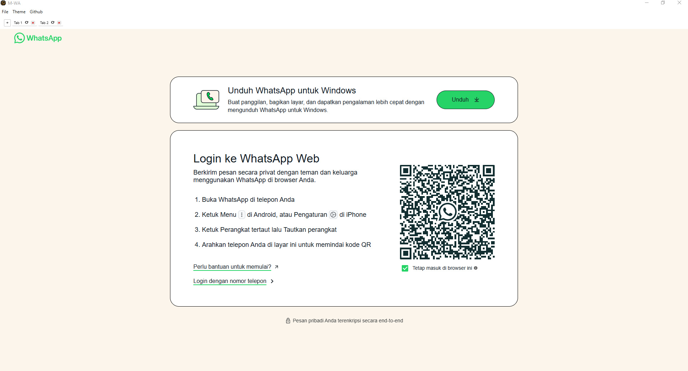

# MWA-Electron

**MWA-Electron** (Multi WhatsApp Accounts via Electron) is a desktop application built with [Electron](https://www.electronjs.org/) that allows you to run multiple WhatsApp Web accounts in a single window using separate tabs. It's ideal for users managing several WhatsApp accounts, such as businesses, customer support teams, or individuals needing to keep accounts separate.

---

## 🚀 Features

* ✅ Multi-tab support for opening multiple WhatsApp Web accounts
* ✅ Each account runs in a separate session partition
* ✅ Sessions are saved locally—no need to log in every time
* ✅ Lightweight and easy-to-use interface
* ✅ Built with Electron + Node.js
* ✅ Dark & Light Mode

---

## 🖥️ Screenshot



---

## 📦 Installation

### 1. Clone the repository

```bash
git clone https://github.com/fitri-hy/MWA-Electron.git
cd MWA-Electron
```

### 2. Install dependencies

```bash
npm install
```

### 3. Run the app

```bash
npm start
```

### 3. Build the app

```bash
npm run build
```

---

## 🧩 Notes

* WhatsApp accounts stay logged in as long as session partitions aren't cleared.
* Make sure you're using the latest version of WhatsApp Web for the best compatibility.
* This app does **not** store your data on any server—all session data is kept locally.

---

## 📄 License

This project is licensed under the [MIT License](LICENSE). Feel free to use, modify, and distribute it as needed.
